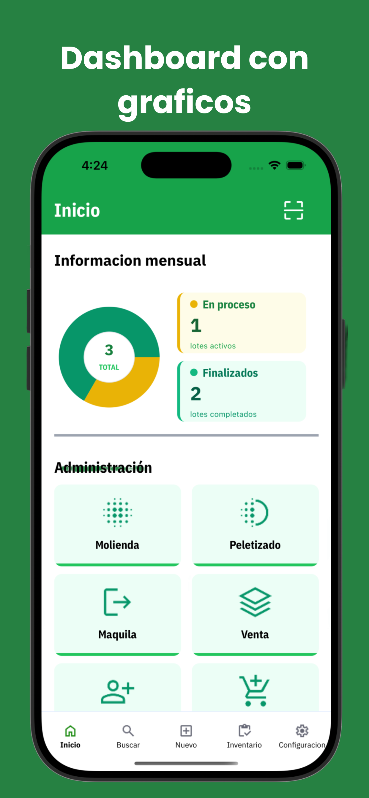
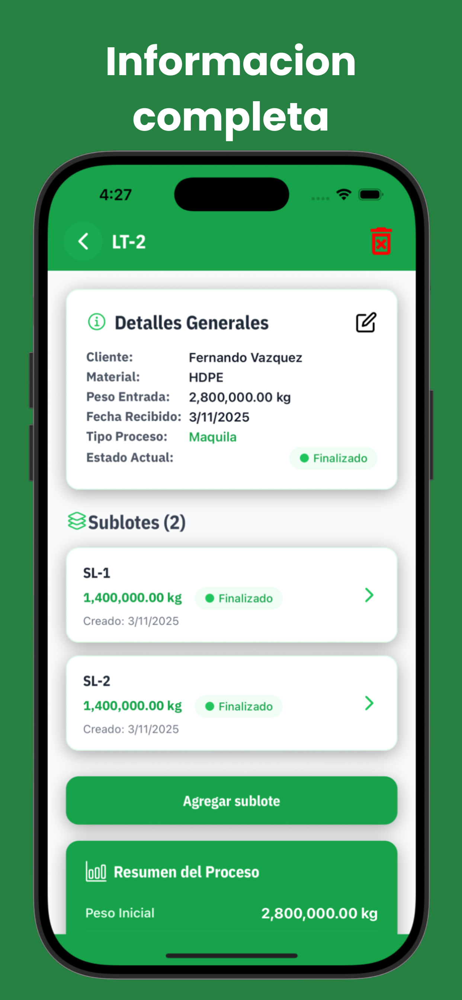
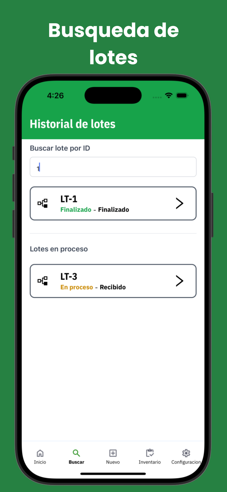
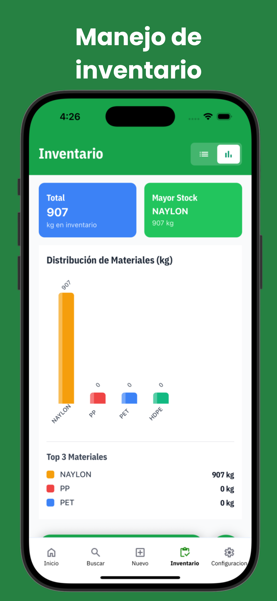

# ♻️ ALRA PLASTIC RECYCLING S.A. de C.V.

Sistema integral de trazabilidad y control desarrollado por **Neurovix** para **ALRA PLASTIC RECYCLING S.A. de C.V.**  
Permite el seguimiento completo del proceso de reciclaje — desde la **entrada del material** hasta la **venta o devolución al cliente** — mediante el uso de **códigos QR**, reportes automatizados y dashboards inteligentes.

---

## 🎥 Ver app
[▶️ Ver video](https://xzeeudfqafydqizuqorm.supabase.co/storage/v1/object/public/lotes/video_welcome.mp4)

---

## 🚀 Funcionalidades principales

### 🔹 Seguimiento de lotes y sublotes
- Alta de **lotes** y **sublotes** con **QR generados automáticamente**.
- Escaneo de QR desde la app para visualizar información del lote o sublote.
- Registro de datos clave: peso, tipo de material, cliente, estado y ubicación.
- Asociación jerárquica entre lotes y sublotes para mantener trazabilidad completa.

### 🔹 Manejo de inventario
- Control de materiales en tiempo real, con actualización automática según movimientos.
- Clasificación por tipo de material (PET, PEAD, PEBD, PP, etc.).
- Gráficos y estadísticas de inventario total y por tipo de material.
- Ajustes automáticos al finalizar o reabrir lotes.

### 🔹 Administración de usuarios
- Sistema de roles con permisos: **Administrador**, **Operador**.
- Registro, edición, suspensión y eliminación de usuarios.
- Autenticación segura mediante **Supabase Auth (JWT)**.

### 🔹 Gestión de materiales y clientes
- Alta, edición y eliminación de materiales reciclables.
- Registro de clientes con historial de ventas, devoluciones y transacciones.
- Reportes filtrados por cliente, material o periodo de tiempo.

### 🔹 Dashboards y analíticas
- Panel principal con estadísticas **mensuales y en tiempo real**:
  - Lotes en proceso 🏭  
  - Lotes finalizados ✅  
  - Material procesado ♻️  
  - Gráficos para el area de inventario 📊  
- Visualización clara para la toma de decisiones operativas.

### 🔹 Reportes automatizados
- **Reporte de lotes:** Al finalizar el lote o al momento que se necesite se puede generar manualmente.
- **Reporte de inventario:** entre `fecha x` y `fecha y`.
- **Reporte de clientes:** con totales, devoluciones y compras.  
- Exportación de reportes a PDF y envío automático por correo.

---

## 🧩 Tecnologías utilizadas

| Componente | Descripción |
|-------------|-------------|
| **Frontend móvil** | React Native + Expo Go + NativeWind |
| **Backend** | Supabase (Base de datos y API REST integrada) |
| **Autenticación** | Supabase Auth (correo y contraseña) |
| **Almacenamiento** | Supabase Storage (reportes y archivos) |
| **Gráficas** |  `react-native-svg` |
| **QR** | Librerías `expo-camera` |

---

### 📱 Estructura general del proyecto
#### 📦 alrasystem
##### ┣ 📂 app/ # Pantallas principales (Dashboards, Lotes, Inventario)
##### ┣ 📂 components/ # Componentes reutilizables (Cards, Buttons, Inputs, etc.)
##### ┣ 📂 lib/ # Conexiones a Supabase, helpers y lógica de negocio
##### ┣ 📂 assets/ # Íconos, logos, imágenes, fonts
##### ┣ 📂 providers/ # Supabase auth
##### ┣ 📂 constants/ # Iconos y fuentes
##### ┣ 📂 database/ # Estructura de la base de datos
##### ┗ 📜 README.md

---

## 📸 Capturas de pantalla

### 👥 Pantalla de bienvenida
> Control de roles, accesos y autenticación segura con Supabase Auth.


---

### 🏠 Dashboard principal
> Información mensual de lotes, sublotes, inventario y rendimiento general.



---

### 📦 Lotes y sublotes
> Informacion completa de un lote con sublotes (incluye imagenes).



---

### 🧾 Busqueda
> Busqueda de lotes en base a su nombre o id.



---

### 🧱 Inventario
> Visualización del inventario actual y graficas para mejor entendimiento.



---

## ⚙️ Instalación y ejecución

### Requisitos previos
- Node.js v18+
- Expo CLI && EAS CLI
- Cuenta en Supabase (con proyecto configurado)
- Dispositivo físico o emulador con **Expo Go**

### Instalación local

```bash
# Clonar el repositorio
git clone https://github.com/neurovix/alrasystem.git
cd alrasystem

# Instalar dependencias
npm install

# Configurar variables de entorno
touch .env.local
# Editar las variables con tu URL y API Key de Supabase
🔑 Variables de entorno (.env)
EXPO_PUBLIC_SUPABASE_URL=https://xxxxx.supabase.co
EXPO_PUBLIC_SUPABASE_ANON_KEY=your_public_anon_key

# Ejecutar la app
npx expo start
```

Luego escanea el código QR con Expo Go para ejecutar la aplicación en tu dispositivo.

📅 Próximas mejoras
🌐 Panel web administrativo (integración con el backend móvil)
📊 Reportes con filtros avanzados y estadísticas inteligentes
📦 Integración con lector QR industrial
🧠 IA para predicción de rendimiento y optimización de planta
📲 Notificaciones push automáticas para estados de lotes

## 👨‍💻 Desarrollado por
- Fernando Alejandro Vazquez Medina
- Fullstack Developer — Fundador de Neurovix
- 📧 fernandovazquez.favm@gmail.com

```bash
🌐 https://neurovix.com.mx
```

## 🏢 Sobre la empresa
- ALRA PLASTIC RECYCLING S.A. de C.V.
```bash
Empresa mexicana dedicada al reciclaje y aprovechamiento sustentable de plásticos industriales.
Este sistema fue desarrollado para digitalizar completamente su operación y optimizar la trazabilidad, control y eficiencia en cada etapa del proceso productivo.
```

### © 2025 Neurovix. Todos los derechos reservados.